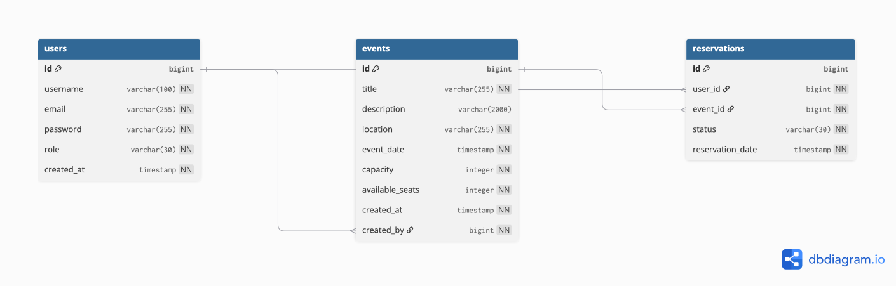
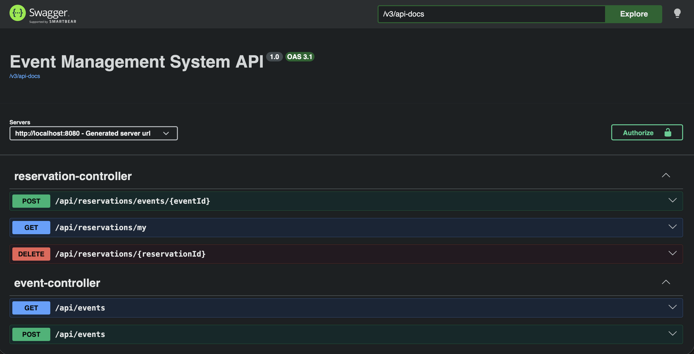
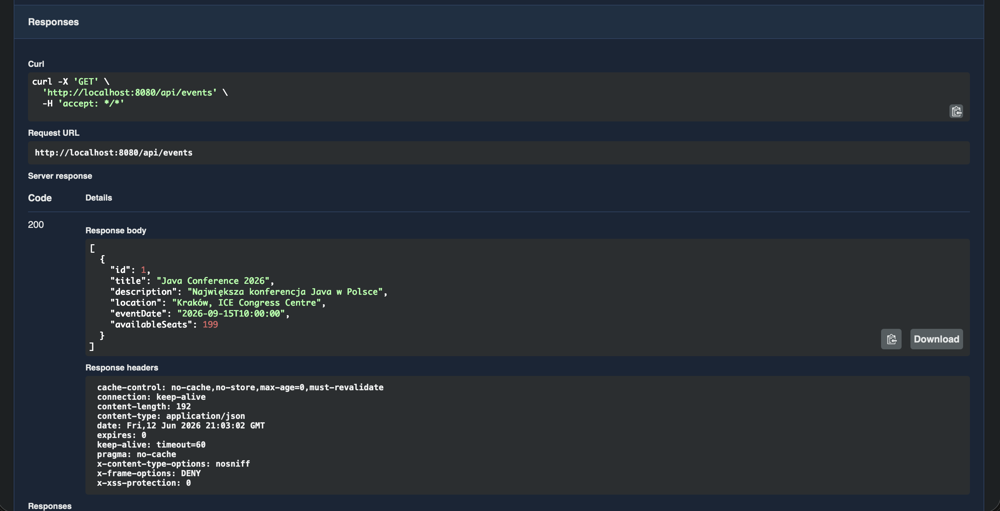
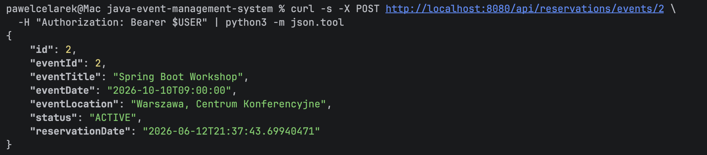
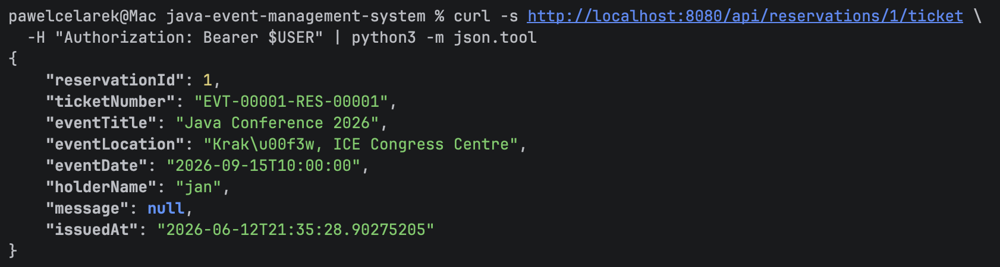
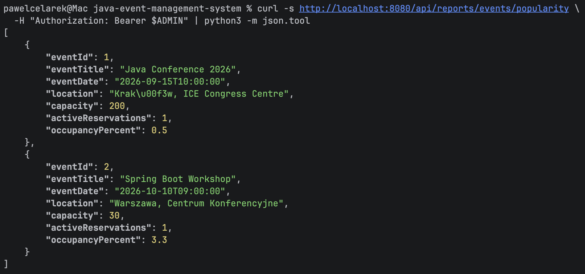
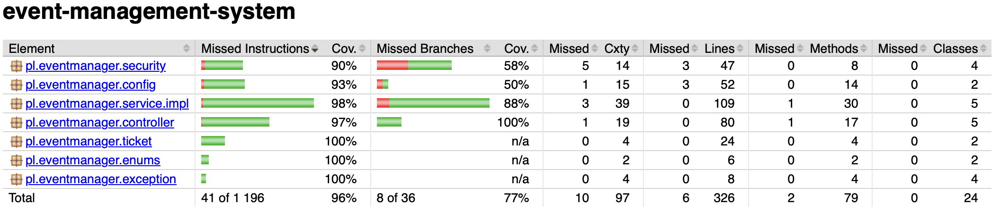

# System Zarządzania Wydarzeniami

Aplikacja RESTful do zarządzania wydarzeniami, zbudowana w Java 17 i Spring Boot 4.

## Stos technologiczny

- **Java 17** + **Spring Boot 4**
- **Spring Security** — uwierzytelnianie JWT, kontrola dostępu oparta na rolach (RBAC)
- **Spring Data JPA** + **Hibernate** — warstwa ORM
- **PostgreSQL** — relacyjna baza danych
- **Flyway** — migracje bazy danych
- **Springdoc OpenAPI** — Swagger UI
- **JaCoCo** — analiza pokrycia testami (96% pokrycia instrukcji)
- **Docker** + **Docker Compose**
- **Maven**

---

## Funkcjonalności

- Rejestracja użytkowników i logowanie przez JWT
- Kontrola dostępu oparta na rolach: `ROLE_USER` i `ROLE_ADMIN`
- Tworzenie i przeglądanie wydarzeń
- Rezerwacja i anulowanie miejsc
- Generowanie biletów z wykorzystaniem **wzorca projektowego Strategy**
- Raporty administratora: uczestnictwo w wydarzeniu i ranking popularności

---

## Wzorce projektowe i polimorfizm

### Wzorzec Strategy — generowanie biletów

Interfejs `TicketGenerator` posiada dwie implementacje wybierane w czasie działania aplikacji na podstawie pojemności wydarzenia:

- `StandardTicketGenerator` — dla dużych wydarzeń (pojemność > 50 miejsc)
- `PersonalizedTicketGenerator` — dla małych wydarzeń (pojemność ≤ 50 miejsc), generuje spersonalizowaną wiadomość dla uczestnika

Demonstracja **polimorfizmu**: obie klasy implementują wspólny interfejs `TicketGenerator`, a właściwa implementacja jest wybierana przez `TicketServiceImpl` w metodzie `selectGenerator()`.

---

## Uruchomienie

### Wymagania

- Docker + Docker Compose

### Start aplikacji

```bash
docker compose up --build
```

Aplikacja dostępna pod adresem: `http://localhost:8080`

### Tworzenie konta administratora

Po uruchomieniu aplikacji zarejestruj użytkownika przez API, a następnie nadaj mu rolę administratora w bazie danych:

```bash
curl -s -X POST http://localhost:8080/api/auth/register \
  -H "Content-Type: application/json" \
  -d '{"username":"admin","email":"admin@example.com","password":"admin123"}'

docker compose exec postgres psql -U postgres -d event_management -c \
  "UPDATE users SET role = 'ROLE_ADMIN' WHERE username = 'admin';"
```

---

## Dokumentacja API

Swagger UI: [http://localhost:8080/swagger-ui.html](http://localhost:8080/swagger-ui.html)

### Endpointy

#### Uwierzytelnianie
| Metoda | Ścieżka | Dostęp | Opis |
|--------|---------|--------|------|
| POST | `/api/auth/register` | Publiczny | Rejestracja nowego użytkownika |
| POST | `/api/auth/login` | Publiczny | Logowanie, zwraca JWT |

#### Wydarzenia
| Metoda | Ścieżka | Dostęp | Opis |
|--------|---------|--------|------|
| GET | `/api/events` | Publiczny | Lista wszystkich wydarzeń |
| POST | `/api/events` | Admin | Tworzenie wydarzenia |

#### Rezerwacje
| Metoda | Ścieżka | Dostęp | Opis |
|--------|---------|--------|------|
| POST | `/api/reservations/events/{id}` | Użytkownik | Rezerwacja miejsca |
| DELETE | `/api/reservations/{id}` | Użytkownik | Anulowanie rezerwacji |
| GET | `/api/reservations/my` | Użytkownik | Lista własnych rezerwacji |

#### Bilety
| Metoda | Ścieżka | Dostęp | Opis |
|--------|---------|--------|------|
| GET | `/api/reservations/{id}/ticket` | Użytkownik | Pobranie biletu dla rezerwacji |

#### Raporty
| Metoda | Ścieżka | Dostęp | Opis |
|--------|---------|--------|------|
| GET | `/api/reports/events/{id}/participation` | Admin | Statystyki uczestnictwa w wydarzeniu |
| GET | `/api/reports/events/popularity` | Admin | Ranking popularności wydarzeń |


---

## Migracje bazy danych

Flyway — migracje w `src/main/resources/db/migration`:

| Wersja | Opis |
|--------|------|
| V1 | Tworzenie tabeli użytkowników |
| V2 | Tworzenie tabeli wydarzeń |
| V3 | Tworzenie tabeli rezerwacji |
| V4 | Ograniczenia i indeksy |
| V5 | Unikalne indeksy case-insensitive dla tożsamości użytkownika |

---

## Diagram ERD



---

## Testy

```bash
./mvnw test
```

Raport pokrycia: `target/site/jacoco/index.html`

### Pokrycie kodu (JaCoCo)

Wyłączenia z pokrycia: klasy DTO i encje (boilerplate — gettery/settery).
Pokrycie logiki biznesowej:

| Pakiet         | Pokrycie |
|----------------|----------|
| `service.impl` | 98%      |
| `controller`   | 97%      |
| `ticket`       | 100%     |
| `security`     | 90%      |
| `exception`    | 100%     |
| `enums`        | 100%     |
| `config`       | 93%      |
| **Łącznie**    | **96%**  |

---

## Screenshoty

### Swagger UI


### Lista wydarzeń


### Rezerwacja miejsca


### Bilet na wydarzenie


### Raport popularności wydarzeń


### Raport pokrycia JaCoCo

